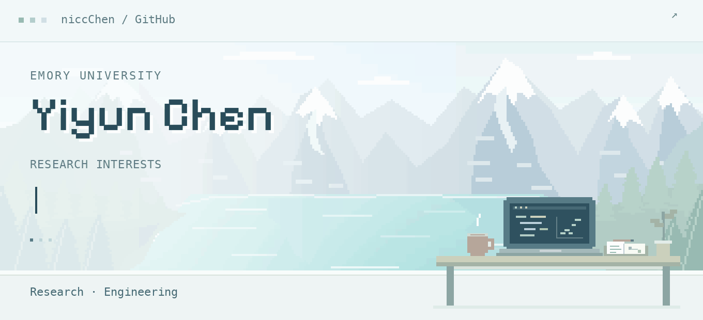

<picture>
  <source media="(prefers-reduced-motion: reduce)" srcset="./assets/banner-work-life-static.png">
  
</picture>

  <a href="https://www.linkedin.com/in/yiyun-chen-1a4a542bb/">LinkedIn ↗</a> &nbsp; · &nbsp;
  <a href="mailto:yiyun.chen@emory.edu">Email ↗</a> &nbsp; · &nbsp;
  <a href="https://github.com/niccChen">GitHub ↗</a>

## 01 / About

I'm Yiyun (Nicole) Chen, an undergraduate at **Emory University** studying Computer Science and Applied Mathematics & Statistics.

## 02 / Research interests

My research interests span **agentic systems, natural language processing, and probabilistic forecasting**. I am interested in how agents use tools and structured feedback to solve complex tasks, how language models reason over contextual and clinical information, and how forecasting models represent uncertainty. Across these areas, I aim to connect rigorous evaluation with practical, reliable systems.

| Research area | What I am interested in |
| --- | --- |
| **Agentic Systems** | Tool-using agents, structured workflows, and reliable evaluation. |
| **Natural Language Processing** | Language understanding, clinical text reasoning, and document intelligence. |
| **Probabilistic Forecasting** | Time-series modeling, uncertainty quantification, and calibrated predictions. |

## 03 / Skills & tools

**Tool Use** · **Structured Outputs** · **Model Evaluation**

<table>
  <tr>
    <td><strong>Languages</strong></td>
    <td>
      <picture><source media="(prefers-color-scheme: dark)" srcset="./assets/badges/python-lake-dark.svg"></picture>
      <picture><source media="(prefers-color-scheme: dark)" srcset="./assets/badges/csharp-lake-dark.svg"></picture>
    </td>
  </tr>
  <tr>
    <td><strong>AI &amp; NLP</strong></td>
    <td>
      <picture><source media="(prefers-color-scheme: dark)" srcset="./assets/badges/pytorch-lake-dark.svg"></picture>
      <picture><source media="(prefers-color-scheme: dark)" srcset="./assets/badges/transformers-lake-dark.svg"></picture>
      <picture><source media="(prefers-color-scheme: dark)" srcset="./assets/badges/rag-lake-dark.svg"></picture>
      <picture><source media="(prefers-color-scheme: dark)" srcset="./assets/badges/mcp-lake-dark.svg"></picture>
    </td>
  </tr>
  <tr>
    <td><strong>Data &amp; scientific computing</strong></td>
    <td>
      <picture><source media="(prefers-color-scheme: dark)" srcset="./assets/badges/numpy-lake-dark.svg"></picture>
      <picture><source media="(prefers-color-scheme: dark)" srcset="./assets/badges/pandas-lake-dark.svg"></picture>
      <picture><source media="(prefers-color-scheme: dark)" srcset="./assets/badges/scipy-lake-dark.svg"></picture>
      <picture><source media="(prefers-color-scheme: dark)" srcset="./assets/badges/pyamg-lake-dark.svg"></picture>
      <picture><source media="(prefers-color-scheme: dark)" srcset="./assets/badges/optuna-lake-dark.svg"></picture>
    </td>
  </tr>
  <tr>
    <td><strong>Vision &amp; visualization</strong></td>
    <td>
      <picture><source media="(prefers-color-scheme: dark)" srcset="./assets/badges/opencv-lake-dark.svg"></picture>
      <picture><source media="(prefers-color-scheme: dark)" srcset="./assets/badges/scikit-image-lake-dark.svg"></picture>
      <picture><source media="(prefers-color-scheme: dark)" srcset="./assets/badges/matplotlib-lake-dark.svg"></picture>
    </td>
  </tr>
  <tr>
    <td><strong>Engineering &amp; tools</strong></td>
    <td>
      <picture><source media="(prefers-color-scheme: dark)" srcset="./assets/badges/dotnet-lake-dark.svg"></picture>
      <picture><source media="(prefers-color-scheme: dark)" srcset="./assets/badges/avalonia-lake-dark.svg"></picture>
      <picture><source media="(prefers-color-scheme: dark)" srcset="./assets/badges/pydantic-lake-dark.svg"></picture>
      <picture><source media="(prefers-color-scheme: dark)" srcset="./assets/badges/jupyter-lake-dark.svg"></picture>
      <picture><source media="(prefers-color-scheme: dark)" srcset="./assets/badges/git-lake-dark.svg"></picture>
      <picture><source media="(prefers-color-scheme: dark)" srcset="./assets/badges/pytest-lake-dark.svg"></picture>
    </td>
  </tr>
</table>

---

  Research &amp; collaboration · <a href="mailto:yiyun.chen@emory.edu">yiyun.chen@emory.edu</a>

