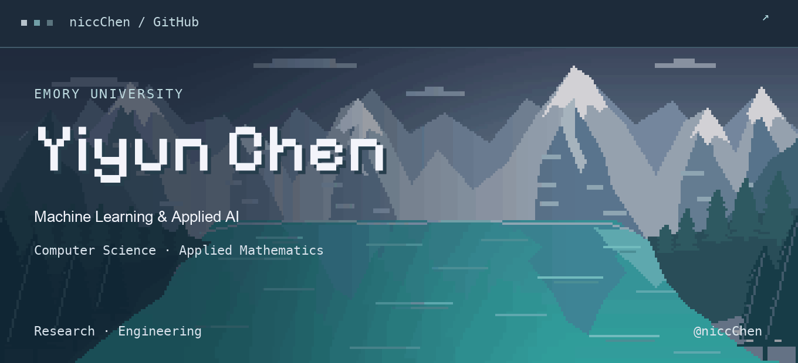

<picture>
  <source media="(prefers-reduced-motion: reduce)" srcset="./assets/banner-banff-static.png">
  
</picture>

  <a href="https://www.linkedin.com/in/yiyun-chen-1a4a542bb/">LinkedIn ↗</a> &nbsp; · &nbsp;
  <a href="mailto:yiyun.chen@emory.edu">Email ↗</a> &nbsp; · &nbsp;
  <a href="https://github.com/niccChen">GitHub ↗</a>

## 01 / About

I'm Yiyun (Nicole) Chen, an undergraduate at **Emory University** studying Computer Science and Applied Mathematics & Statistics.

My research interests include **clinical NLP, multimodal reasoning, and probabilistic forecasting**. My applied AI work includes RAG pipelines and document intelligence.

## 02 / Technical skills

<table>
  <tr>
    <td><strong>Languages</strong></td>
    <td>
      <picture><source media="(prefers-color-scheme: dark)" srcset="./assets/badges/python-dark.svg"></picture>
      <picture><source media="(prefers-color-scheme: dark)" srcset="./assets/badges/csharp-dark.svg"></picture>
    </td>
  </tr>
  <tr>
    <td><strong>ML &amp; vision</strong></td>
    <td>
      <picture><source media="(prefers-color-scheme: dark)" srcset="./assets/badges/pytorch-dark.svg"></picture>
      <picture><source media="(prefers-color-scheme: dark)" srcset="./assets/badges/opencv-dark.svg"></picture>
      <picture><source media="(prefers-color-scheme: dark)" srcset="./assets/badges/scipy-dark.svg"></picture>
      <picture><source media="(prefers-color-scheme: dark)" srcset="./assets/badges/scikit-image-dark.svg"></picture>
    </td>
  </tr>
  <tr>
    <td><strong>Data &amp; viz</strong></td>
    <td>
      <picture><source media="(prefers-color-scheme: dark)" srcset="./assets/badges/numpy-dark.svg"></picture>
      <picture><source media="(prefers-color-scheme: dark)" srcset="./assets/badges/pandas-dark.svg"></picture>
      <picture><source media="(prefers-color-scheme: dark)" srcset="./assets/badges/matplotlib-dark.svg"></picture>
      <picture><source media="(prefers-color-scheme: dark)" srcset="./assets/badges/jupyter-dark.svg"></picture>
    </td>
  </tr>
  <tr>
    <td><strong>Engineering</strong></td>
    <td>
      <picture><source media="(prefers-color-scheme: dark)" srcset="./assets/badges/rag-dark.svg"></picture>
      <picture><source media="(prefers-color-scheme: dark)" srcset="./assets/badges/mcp-dark.svg"></picture>
      <picture><source media="(prefers-color-scheme: dark)" srcset="./assets/badges/dotnet-dark.svg"></picture>
      <picture><source media="(prefers-color-scheme: dark)" srcset="./assets/badges/avalonia-dark.svg"></picture>
    </td>
  </tr>
</table>

---

  Research &amp; collaboration · <a href="mailto:yiyun.chen@emory.edu">yiyun.chen@emory.edu</a>

